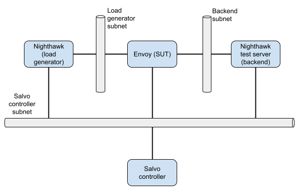

# Sandboxes for remote Salvo executions

This directory contains definition of sandboxes. A sandbox are all the
resources deployed in AWS for a single Salvo execution. At the minimum a sandbox will contain:

- a VM running Nighthawk (the load generator).
- a VM running Envoy (the system under test or SUT).
- a VM running the Nighthawk test server (the test backend).

Note that the subnets used between the components are part of the common
infrastructure and are already deployed as part of the [VPC
configuration](https://github.com/envoyproxy/ci-infra/blob/main/salvo-infra/vpc.tf)
done in the
[ci-infra](https://github.com/envoyproxy/ci-infra/tree/main/salvo-infra)
repository.

Various sandbox types differ in the amount of instances deployed, amount of
support systems deployed and the topology.

# Available Sandbox types

## The default sandbox

The default contains the bare minimum of components needed to execute Salvo
tests. The diagram below outlines the topology and content of the default
sandbox. The default sandbox is currently available for the `x64` architecture
only.



# Sandbox creation

When Salvo executes, the CI pipeline will produce binaries and VM disk images
for all the components. Once that is done, a new CI job is executed in the
`salvo-control` agent pool on AZP. This job is then picked up by a Salvo
control VM that instruments the sandbox creation.

The control VM uses the Terraform templates found in this directory,
to deploy the sandbox components in AWS.

# Sandbox instance life-cycle

The Terraform configuration for sandboxes uses shared state bucket deployed in
S3 on AWS. The sandbox instances that will be deployed or destroyed are
determined based on the variables passed to Terraform.

Each of the following variables is a list of build IDs. Each list represents
one sandbox type. Each listed build ID represents an instance of the sandbox
type that should be deployed. The build IDs must match the AZP build ID of the
[CI
pipeline](https://github.com/envoyproxy/envoy-perf/blob/main/salvo-remote/azure-pipelines/salvo_pipelines.yml)
execution that produced the binaries and VM images for this Sandbox.

Supported sandbox types:

- `default_sandbox_x64_build_ids`.

For example the Terraform command to deploy a single instance of the default
sandbox with build ID `136112\` is:

```shell
terraform apply --var="default_sandbox_build_ids=[\"136112\\"]"
```

Any instances that were deployed, but are not named in the variables passed to
Terraform will be destroyed when Terraform is executed. To remove all deployed
sandboxes, simply execute `terraform apply` in this directory with no
arguments.

```shell
terraform apply
```
