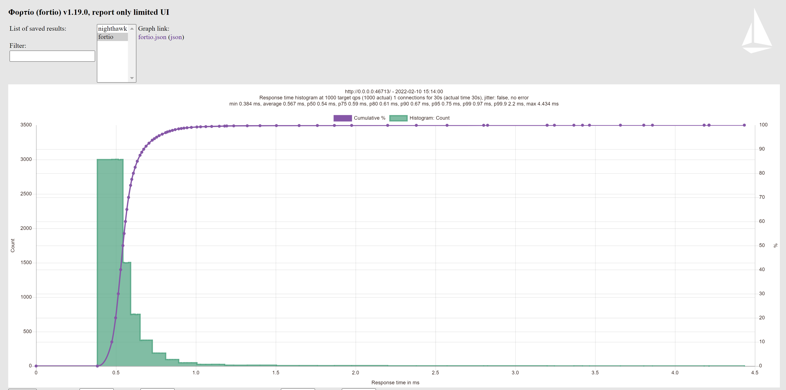

# Measure Envoy's Performance Change with an A/B Testing

## Objective 

This documentation will describe the user journey and detailed workflow to use Salvo to measure Envoy's performance change with an A/B testing.

## User Journey

You are implementing a new feature in Envoy and reach a point where you need to decide between two possible implementation approaches. You wonder what are the performance implications of each choice and decide to run the benchmarking framework to find out. You run two executions in A/B testing mode, both comparing an official Envoy version to an Envoy version with your change using one of the approaches. Once the tests complete, you examine the results and choose an implementation approach with the better performance characteristics.

## Workflow

This section will describe the whole workflow to use Salvo to Measure Performance Change with an A/B Testing. And we will use [Binary Benchmark](./README.md#binary-benchmark) as an example.

1. The requirements to build Envoy and Nighthawk in local machine

    In oder to build Envoy and Nighthawk in local machine, follow [this documentation](https://www.envoyproxy.io/docs/envoy/latest/start/building.html#linux-mac-target-requirements) to ensure local machine meets the requirements. 

2. Download Salvo

    The next step is to download Salvo project from github, you can use `git clone` command:

    ```bash
    git clone https://github.com/envoyproxy/envoy-perf.git
    cd envoy-perf/salvo
    ```

3. Install dependencies 

    Before using Salvo, you need to install its dependencies. The [install_deps.sh](./install_deps.sh) script can be used to install any dependencies required by Salvo. 

    ```bash
    ./install_deps.sh
    ```

4. Build Salvo

    The next step is to build Salvo, Salvo can be built by [Bazel](https://docs.bazel.build/versions/main/install-ubuntu.html):

    ```bash
    bazel build //...
    ```

5. Binary Benchmark Configuration
    
    For an example, you committed two Envoy code changes to your forked repo "https://github.com/gyohuangxin/envoy" and the commit hashes were "c2e1c0d0da61f3fec25f48f8bd63e4a76db8a2a9" and "e95717bcd0672910826de4a9bb2f402f6e057b2c". Then you want to measure their performance change to Envoy v1.21.0 as the baseline and choose the commit which has the better performance. 
    
    You can compose the configuration of Salvo as below:

    ```yaml
    remote: false
    binaryBenchmark: true
    environment:
      outputDir: /home/ubuntu/nighthawk_output
      testVersion: IPV_V4ONLY
    images:
      nighthawkBenchmarkImage: envoyproxy/nighthawk-benchmark-dev:latest
    source:
    - identity: SRCID_ENVOY
      commit_hash: v1.21.0
      additional_hashes: [c2e1c0d0da61f3fec25f48f8bd63e4a76db8a2a9, e95717bcd0672910826de4a9bb2f402f6e057b2c]
      source_url: https://github.com/gyohuangxin/envoy.git
      bazelOptions:
      - parameter: --jobs 16
      - parameter: --define tcmalloc=gperftools
    - identity: SRCID_NIGHTHAWK
      source_url: https://github.com/envoyproxy/nighthawk.git
      bazelOptions:
      - parameter: --jobs 16
      - parameter: --define tcmalloc=gperftools
    ```

    The `environment.outputDir` is directory where benchmark results placed. And the `environment.testVersion` specify the ip address family to use, choose from "IPV_V4ONLY", "IPV_V6ONLY" and "ALL".

    The `images.nighthawkBenchmarkImage` specifies the name of the docker image containing the benchmark framework and default test cases. If you want to provide your own test cases, you can create a directory and put test files like this [one](https://github.com/envoyproxy/nighthawk/blob/main/benchmarks/test/test_discovery.py) into this directory, then add the directory path to `environment.testDir` field. The next section will introduce the details of test cases.

    Salvo will search in the repo from `source.source_url` for each hash in the `source.additional_hashes` list, and choose the baseline version v1.21.0 from `source.commit_hash`. `source.commit_hash` field can be filled in a commit hash or a commit tag, which Salvo can judge automatically and search for.

    Then Salvo will build each Envoy commit and the baseline version. You can add bazel options in `source.bazelOptions`, and they will be added as parameters to bazel command when building Envoy.  

    Finally you can also determine which Nighthawk version to use like Envoy's configuration, in this section we will build the latest Nighthawk version. You can find more details about configuration fields from [APIs definition](./api). 

6. Details of test cases

    The Benchmark Framework is developed via PyTest Framework. Therefore, the test cases file is defined as a python file contains the test cases. The [default test cases file](https://github.com/envoyproxy/nighthawk/blob/main/benchmarks/test/test_discovery.py) provides an example to configure Nighthawk client/server, outputs and test cases.

    There are two main parts in the test case file.

    - `_run_benchmark` function: 

      At first, it defined a function named [`_run_benchmark`](https://github.com/envoyproxy/nighthawk/blob/main/benchmarks/test/test_discovery.py#L20) to run the specific PyTest fixture, which will define the behavior of Envoy and [Nighthawk test server](https://github.com/envoyproxy/nighthawk/blob/main/source/server/README.md) to be tested, you can find fixture definitions from these two files:

      https://github.com/envoyproxy/nighthawk/blob/main/benchmarks/envoy_proxy.py

      https://github.com/envoyproxy/nighthawk/blob/main/test/integration/integration_test_fixtures.py
    
      Then, the `_run_benchmark` function provides some configurable parameters used by Nighthawk client to send test requests, such as `rps`, `duration`, `request_body_size` and so on. By default, Nighthawk will use closed-loop mode, because closed-loop testing can be useful to get a sense of the maximum requests per second that can be squeezed out of a system (irrespective of the high latency incurred), as well as for comparing numbers with other load generators that use this methodology. More details about closed-loop mode: https://github.com/envoyproxy/nighthawk/blob/main/docs/root/terminology.md#closed-loop

      Finally, `_run_benchmark` function defines the format of result outputs after the benchmark is done.

    -  Test cases functions: 

        After `_run_benchmark` function defined, you can write the specific test cases to use it. Take [`test_http_h1_small_request_small_reply_via`](https://github.com/envoyproxy/nighthawk/blob/8d6947b2d4b41edf0ea95a811d129c7a81629b86/benchmarks/test/test_discovery.py#L87) as an example, it will setup a Nighthawk client as the frontend, the Envoy Proxy to be tested as the load balancer, and a Nighthawk test server as the backend. The configurations of Envoy and test server can be assigned with Python decorators. Then you can invoke `_run_benchmark` function with specific fixture and parameters. 

        More test cases examples: https://github.com/envoyproxy/nighthawk/blob/8d6947b2d4b41edf0ea95a811d129c7a81629b86/benchmarks/test/test_discovery.py#L92-#L119

7. Run Salvo

    To run Salvo, use the following command:

    ```bash
    bazel-bin/salvo --job <path to>/<binary_benchmark>.yaml
    ```

8. The Benchmark Result 

    Salvo creates a symlink in the local directory to the location of the output artifacts for each Envoy version tested.

    ```
    ~ envoy-perf/salvo# ls -l |grep source_url

    lrwxrwxrwx 1 root root   80 Feb  7 02:17 source_url__c2e1c0d0da61f3fec25f48f8bd63e4a76db8a2a9 -> /home/ubuntu/nighthawk_output/source_url__c2e1c0d0da61f3fec25f48f8bd63e4a76db8a2a9
    lrwxrwxrwx 1 root root   80 Feb  7 02:17 source_url__e95717bcd0672910826de4a9bb2f402f6e057b2c -> /home/ubuntu/nighthawk_output/source_url__e95717bcd0672910826de4a9bb2f402f6e057b2c
    lrwxrwxrwx 1 root root   47 Feb  2 16:32 source_url__v1.21.0 -> /home/ubuntu/nighthawk_output/source_url__v1.21.0
    ```

    In these directories, you can find benchmark results of different test cases, and the `nighthawk-human.txt` file provides the human-readable benchmark results from Nighthawk. 

    The benchmark results can be visualized via [Fortio's report-only UI](https://github.com/fortio/fortio#report-only-ui). The following is an example.

    ```
    fortio report --data-dir /home/ubuntu/nighthawk_output/source_url__c2e1c0d0da61f3fec25f48f8bd63e4a76db8a2a9/2022-02-21-05-16-54/http_h1_small_request_small_reply_via_IpVersion.IPV4-nighthawk_test_integration_configurations_nighthawk_http_origin.yaml-nighthawk_benchmarks_configurations_envoy_proxy.yaml
    ```

    